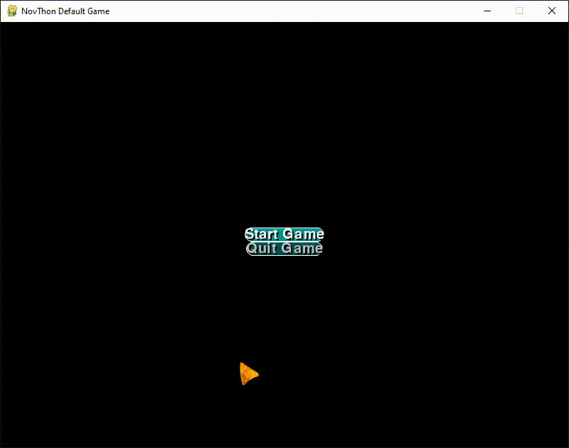

# Update
This version comes with brand new text box feature, `cmenu` function (the python-equivalent of `cmenu` part) 
comes with a new argument `fit_text`, if it's True, the box is resized to the text's size, you can achive the
same effect by adding a `True` after the dictionary of `cmenu` part. (Example: Watch `data/special_scene.py`)

With the brand new text box feature, there comes some new configs for it: 
- `box_alpha`: Set the alpha of the box, default is `150`
- `box_color`: The fill color of the box. Default is `blue`, while the demo is `darkcyan`
- `box_outline_size`: The size of the box's outline, default is `2`, while the demo is `1`.
- `box_border`: The roundness of the box's border, default is `6`, while the demo is doubled.
- `box_select_color`: The color of the box when it's selected in `menu` or `cmenu`, default is `darkblue`, while
the demo is `darkcyan`

The demo game includes a new ending, a normal one, which is the same as the good one, except the player meets Nov
at the same place in the night only.

Here is a clip (converted to gif) with the full game (with all endings).

  